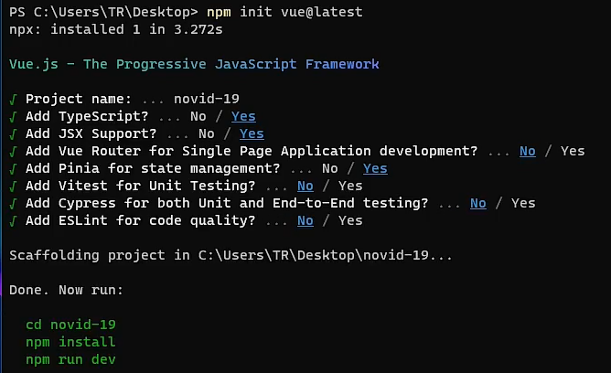

# 1、后端环境

npm install ts-node -g

npm init -y

npm install @types/node -D

npm install express -S

npm install @types/express -D

npm install axios -S

# 2、前端环境

npm init vue@latest

npm install

npm install less less-loader -D

npm install axios -S

npm install animate.css -S

下载json2ts插件，在json文件中按下ctrl+alt+v可以快速生成类名

